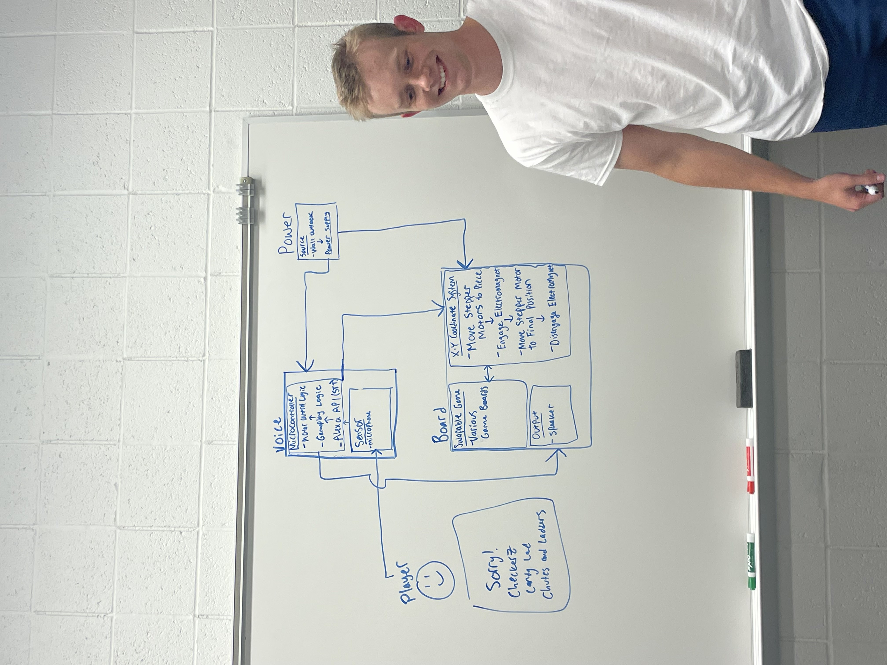
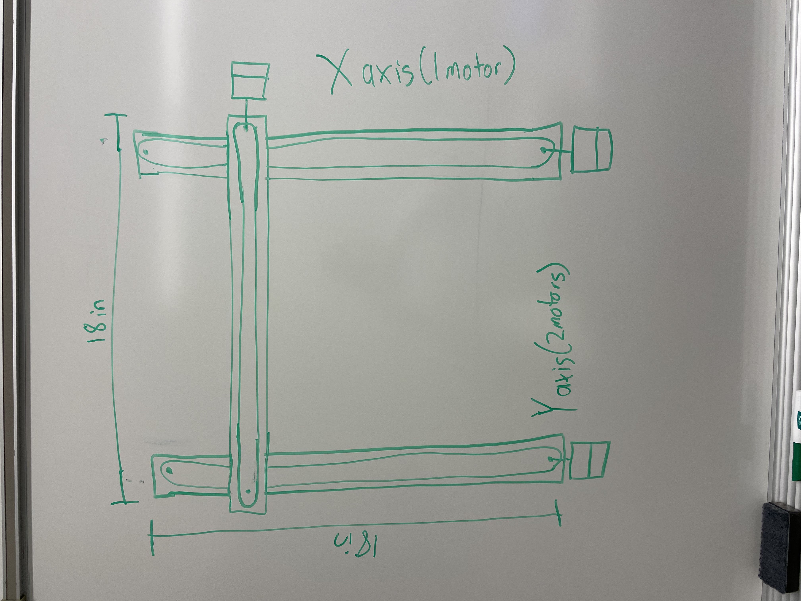
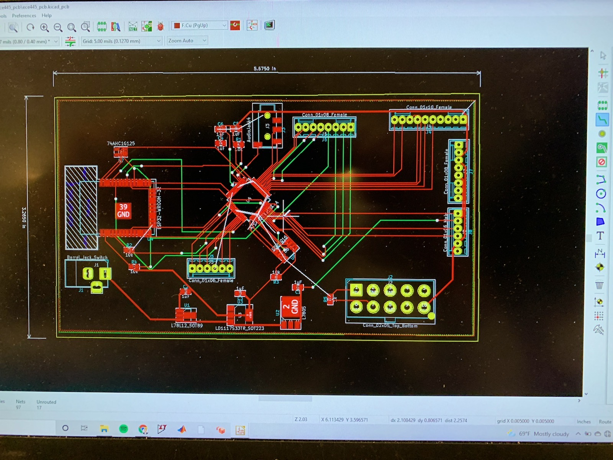
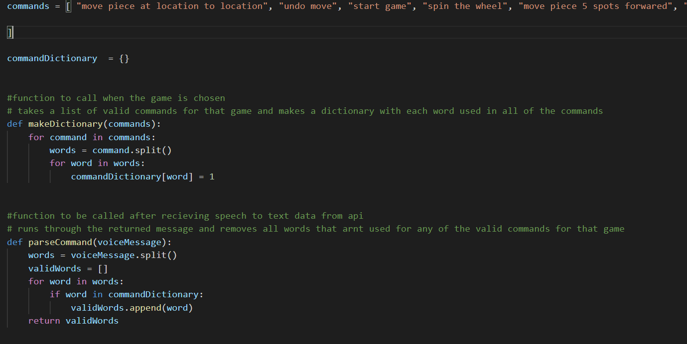
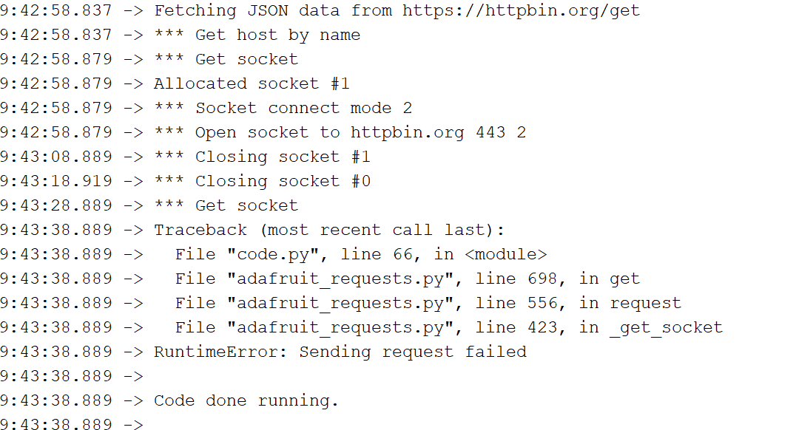
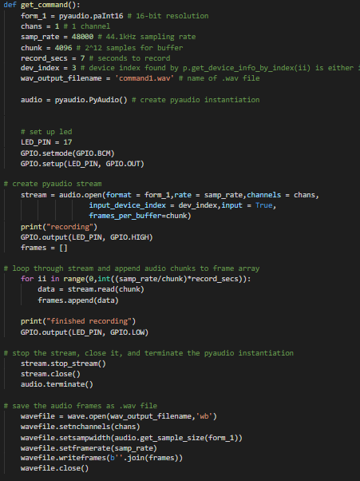
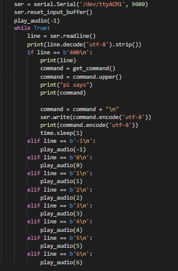

September 7th:

Research microcontroller
Did some research on which microprocessor and software we should be using. TA suggested the Arm cortex m4 and circuit python. These look like they will work fine.

September 13th:

Make Block Diagram
Met as a group to design our block diagram for the project. We decided on having 3 subcomponents Voice, power and Board control.

September 24th:

Meet with Machine Shop
Met with the machine shop to discuss the physical design of our project, confirmed that we are incharge of choosing and sourcing our own motors. We decided that our best course of action for implementing multiple board games is to have two pieces
of poly corbonate that can have a piece of paper slid imbetween that has an image of the boardgame we want to play.  The poly corbonate sheets are going to be 1/16th of an inch thick. Greg helped me find an electromagnet that should fit our needs.
the magnet that I have been using to test has 12 pounds of pull force and the electro magnet that we found has 26 pounds of pull force so it should be more than enough.
Machine shop says we would be ahead of schedule if we get final design to them by next week

September 27th: 
Finalize physical design
We drew out a final design for what we needed the board to look like to send it to the machine shop. decided on 18 by 18 inch size with 16 by 16 playable area.

October 6th:
Finalize first PCB design
We met as a group to finalize the pcb design. made sure that we had no bridges and then sent it to dean to get his feedback and see if there were any mistakes that he could catch. He didnt find any so we submitted it

October 14th: 
Start writing code
Started writing some of the code to get us on track. Wrote a function that would set up a dictionary of all words that could appear in a valid command, and then another function that took in a command and removed any words that did not appear in that dictionary.

October 21st:
Write API Code
Started to write the api code but I ended up hitting a wall. Currently coding on the Metro M4 airlift lite Dev board and I cannot get Post requests to work. I can run test get requests but when I try and make a post request it fails.
I am pretty sure that my API call code is correct and that I am formating the post request correctly but I am not getting any results. Emailing dean for advise

October 25th:
Finalizing with the Machine Shop
Got an email from the machine shop saying that they already had a similar board to the one that we wanted them to create. going to meet with them to discuss the modifications that need to be done to make it fit all of our needs.

October 28th: 
Meet with machine shop
Met with the machine shop they told me how they were going to modify the existing board and said that it should be done by lunch tomorrow

November 1st: 
Fix api call
Spent most of the day on the adafruit discord discussing with people on there why I might not be able to send post requests. At first I thought that the error had something to do with the ssl context because an http get request would work but an https get request would not and all the post requests that I was making were https requests. ended up reading through all of the requests library send request functions and making a version that would print more information for me to see.
this didnt prove very useful but I now have a much better understanding on how a post request is performed. Member of adafruid discord suggested some tests for me to run to see where the issue lied but none of them proved useful except for proving that my code was acting the way it was expected to until it stops.
finally after hours of debugging I decided to try what dean suggested and connect to my phones hotspot instead of the school wifi and that fixed the issue. For some reason the school wifi doesnt like microcontrollers sending https requests but is fine with them sending http requests.

November 3rd:
Finish API call
Tried to finish the api call but ended up running into another issue. The microcontroller only has 124 kb of memory availible to me and the files we are trying to send are way to big to work. I tried to use the garbage collector to save as much memory as possible but I can barely get it to work. Json basically quadrupales the size of the file and makes a copy so how ever big the file is we need close to 8 to 10 times the size of the file availible in memory. Currently using Wav files which are about 100kb per second .
I was able to get it to work if I used an online converter to convert the file into AMR format which is tiny in comparison to the WAV file but I cant find any support for it besides the online converter. Google accepts it but I need a way to actually get the audio files that we record into this format. dean suggested having a seperate raspberry pi that handles recording the audio and converting it into the amr format before sending it to the microcontroller to be used with the api so I will try that next.

November  15th:
Write Raspberry Pi code
started to program the raspberry pi by sshing in from my computer but this was deemed ineffective because I need to download updates for it and I cannot when it is connected to my computer
ordering an hdmi to microhdmi adapter. Raspberry pi code is written so once that arrives I can start to test it

November 25th:
Write Raspberry Pi code
Adapter arrived and I spend the day downloading librearies and testing my code. None of it works. Especially the api to the online converter. I cannot get it to format correctly

November 28th:
Write Raspberry Pi code
Got Audio recording to work and can save the recordings as audio files. Api still not working.

November 28th:
Write Raspberry Pi code and test game logic code
Switched to doing speech to text api call on the raspberry pi and skipping the file conversion step and sending as a Wav file instead since the raspberry pi doesnt have any of the memory limitations, I Got the api call to work and can even record my own audio files and send them to the api abnd get a response. Next problem is setting up the serial communication between the microcontroller and the raspberry pi
also spent some time working with rafal to test the motor and game logic code. Checkers is half working right now so once the serial communication is set up we can test sending ciommands directly from the raspberry pi speech input.
also audio output is working

November 29th:
Finish serial communication code and fix game logic code
Got the serial communication working after a few hours of debugging. spent the remaining part of the day testing the full product to find errors in the logic. also added a list of phrases to the api call so that the api has all the possible words that it should be looking for
adding this basically doubled the consistency of getting a command without any wrong words.

